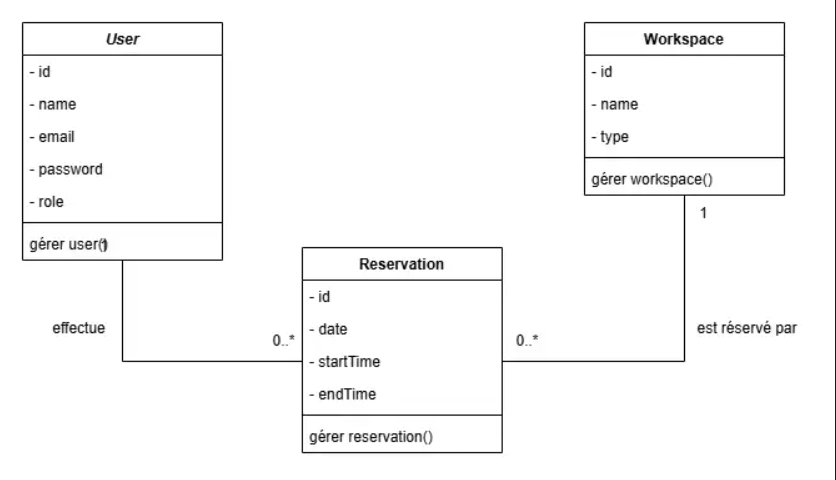

# 🧠 Réservation Intelligente pour Espaces de Coworking (Academic project [GraphQL,SpringBoot])

## 🚀 Solution Proposée

### 🔍 1. Analyse du Problème

Actuellement, le système de réservation repose sur des méthodes manuelles comme un cahier ou Google Sheets, entraînant :
- Des **conflits de réservation** fréquents (double-booking).
- Une **absence de notifications** ou vérifications automatiques.
- Une **perte de temps** pour le staff et les utilisateurs.

L'objectif est de concevoir un **web service intelligent** qui :
- Garantit l’**exclusivité des créneaux réservés**.
- Permet une **consultation en temps réel** des disponibilités.
- Prend en charge les **règles de rôles (ADMIN vs CLIENT)**.
- S’intègre à une interface (potentiellement web/mobile) via **GraphQL**.

---

### 🧩 2. Identification des Entités et Relations

#### 📌 Diagramme de class :



### ⚙️ 3. Liste des Fonctionnalités (Web Service)

#### ✅ Authentification & rôles :
- `/register` (uniquement pour `CLIENT`)
- `/login` → Génère un JWT
- Accès conditionnel aux mutations/queries selon le rôle (`@PreAuthorize` implicite)

#### 📆 Gestion des Réservations :
- Créer une réservation (par `CLIENT` pour lui-même ou par `ADMIN` pour un autre utilisateur)
- Modifier / Supprimer une réservation
- Voir ses propres réservations (`CLIENT`)
- Voir toutes les réservations (`ADMIN`)
- Détection automatique de **conflit de créneaux horaires**

#### 🏢 Gestion des Espaces de Travail :
- Ajouter / Modifier / Supprimer un espace (ADMIN)
- Voir tous les espaces (ADMIN)
- Voir uniquement les espaces disponibles (CLIENT)
- Rechercher les espaces disponibles pour une date + créneau horaire

---

### 🧾 4. Schéma des Requêtes & Réponses GraphQL

#### Exemple – Créer une réservation (CLIENT)


 ####requête
```
mutation {
  createMyReservation(input: {
    workspaceId: 3
    date: "2025-06-13"
    startTime: "14:00"
    endTime: "16:00"
  }) {
    id
    date
    startTime
    endTime
    workspace {
      name
    }
  }
}
```
####Réponse
```
{
    "data": {
        "createMyReservation": {
            "id": "6",
            "date": "2025-06-13",
            "startTime": "14:00",
            "endTime": "16:00",
            "workspace": {
                "name": "Meeting ROOM B"
            }
        }
    }
}
```

#### Exemple  – Obtenir les espaces disponibles (CLIENT)
####requête
```
query {
  getAvailableWorkspaces (date: "2025-06-20", startHour: 8, endHour: 10) {
    id
    name
    type
  }
}
```
####Réponse
```
{
    "data": {
        "getAvailableWorkspaces": [
            {
                "id": "1",
                "name": "Updated DESK To ROOM",
                "type": "ROOM"
            },
            {
                "id": "2",
                "name": "Updated DESK To ROOM",
                "type": "ROOM"
            },
            {
                "id": "5",
                "name": "Meeting ROOM D",
                "type": "ROOM"
            },
            {
                "id": "9",
                "name": "Meeting DESK D",
                "type": "DESK"
            }
        ]
    }
}
```
---

### 🔐 5. Contrôle d'accès & Endpoints GraphQL

#### 🎯 Rôles & Permissions

| Rôle   | Permissions                                                                 |
|--------|------------------------------------------------------------------------------|
| CLIENT | Réserver, consulter ses réservations, voir les espaces disponibles          |
| ADMIN  | Gérer tous les utilisateurs, espaces, réservations                          |


---
### 📎 6. Endpoints principaux (via GraphQL)

| Type     | Nom de l'opération                              | Description                                      |
|----------|--------------------------------------------------|--------------------------------------------------|
| Query    | `getWorkspaces()`                               | Tous les espaces (filtrés selon le rôle)         |
| Query    | `getAvailableWorkspaces(date, startHour, endHour)` | Espaces sans conflit pour un créneau donné    |
| Mutation | `createWorkspace(input)`                         | ADMIN uniquement                                 |
| Mutation | `createMyReservation(input)`                     | CLIENT uniquement                                |
| Mutation | `updateReservation(id, input)`                   | ADMIN ou propriétaire                            |
| Mutation | `cancelReservation(id)`                          | ADMIN ou propriétaire                            |


